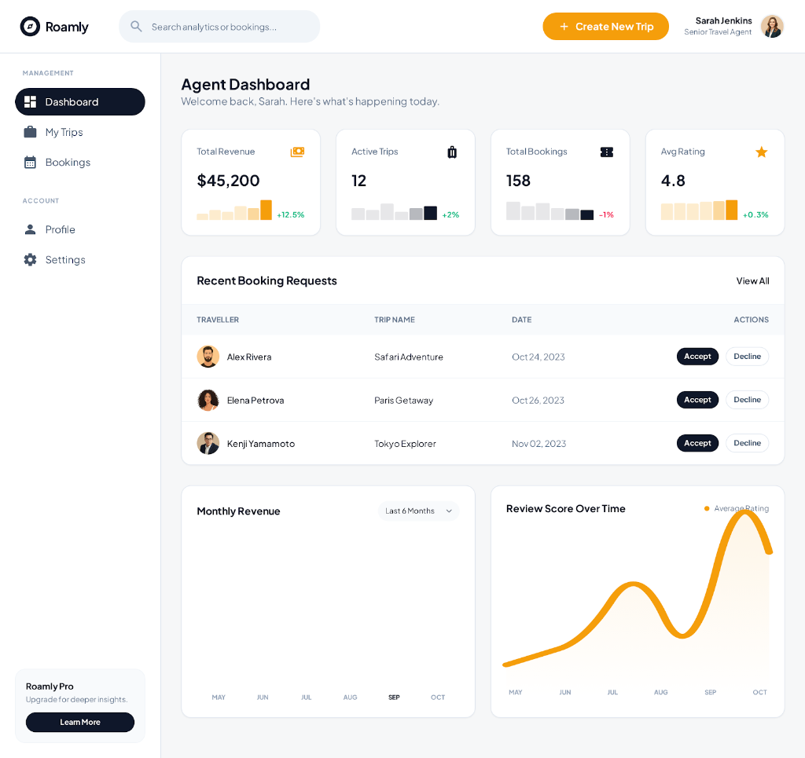
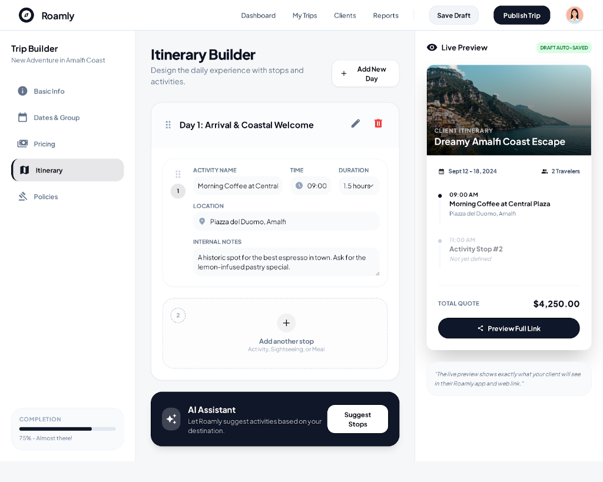
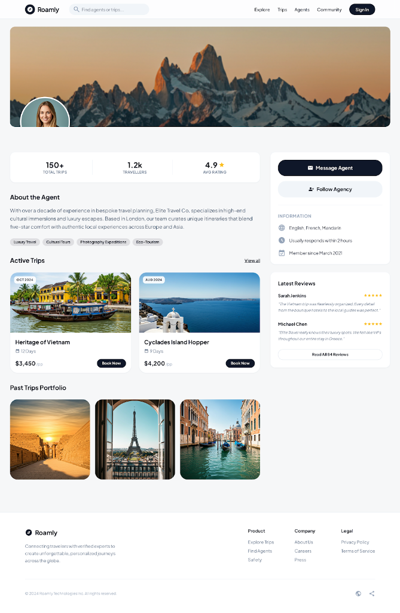
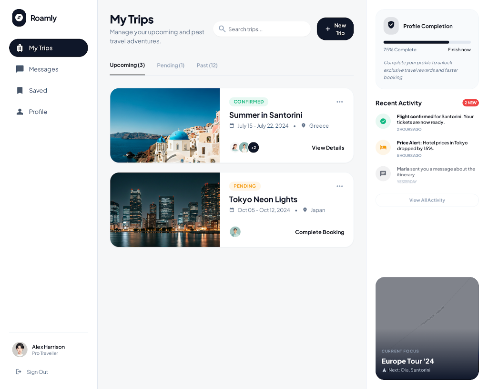
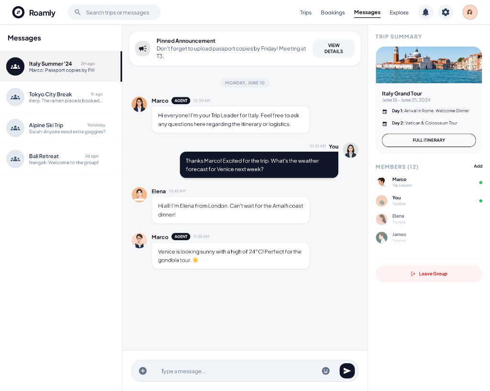
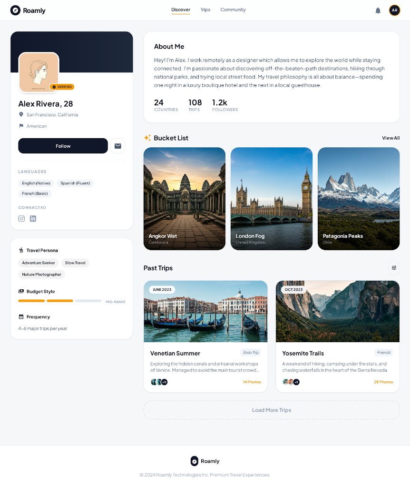
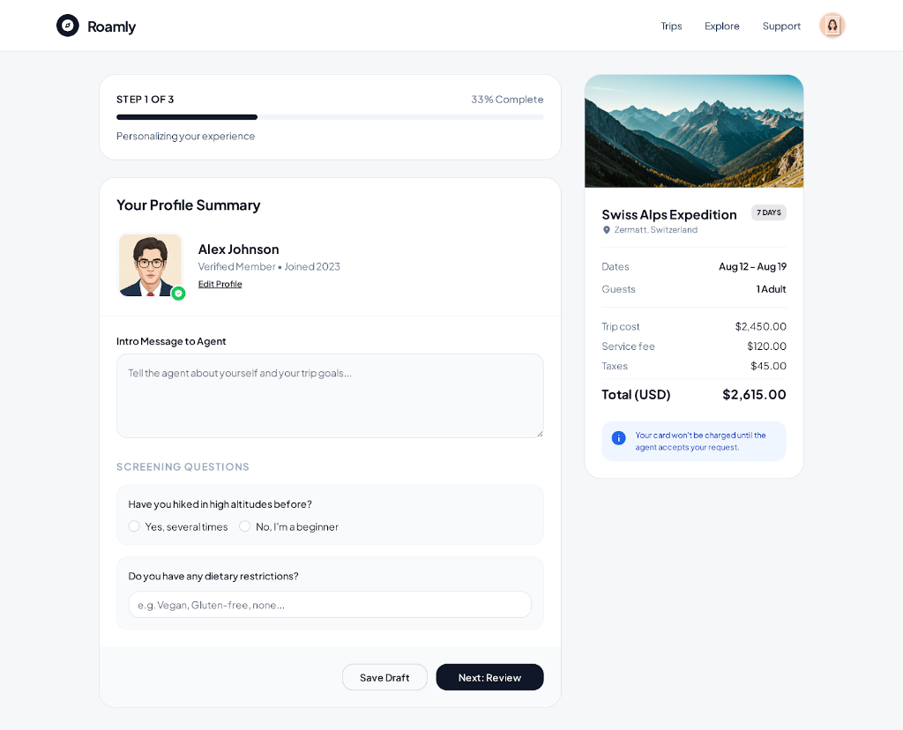
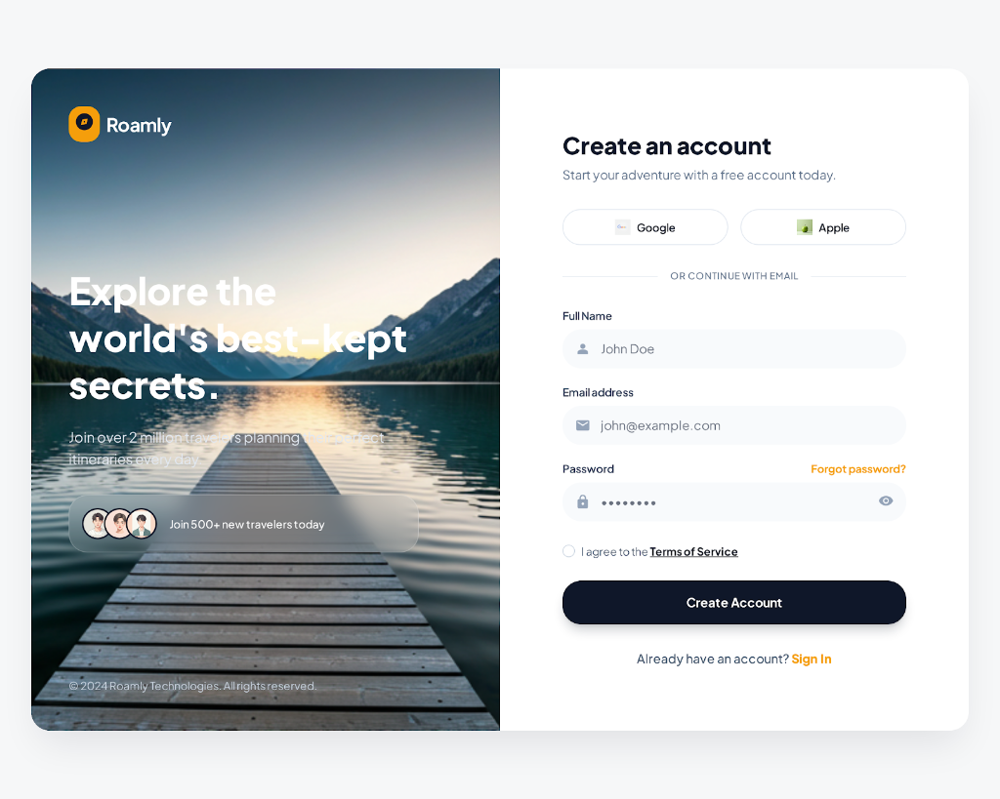
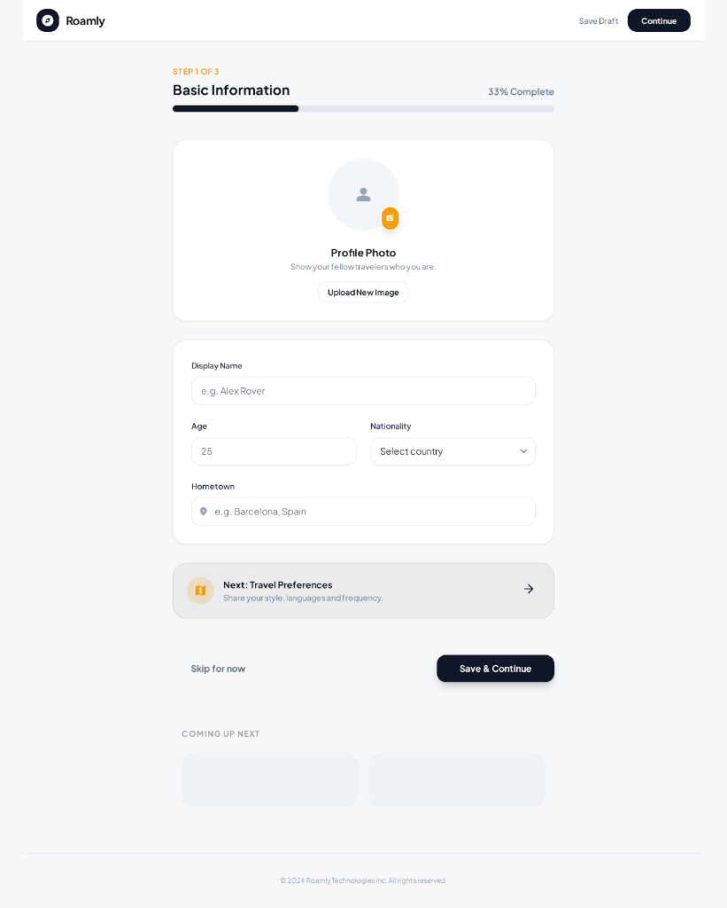

# 🌍 Roamly

**Roamly** is a premium, AI-powered B2B2C travel marketplace designed to connect passionate travelers with expert travel agents. Built with a focus on high-end aesthetics and seamless user experiences, Roamly empowers agents to build empires and travelers to discover their next great adventure.

## 🧩 The Problems We Solve

Roamly was built to bridge the gap in the fragmented travel industry by addressing critical pain points for all stakeholders.

### 🎒 Traveler Pain Points
- **Solo travel is lonely**: Roamly provides a structured way to find like-minded companions, replacing chaotic social media groups.
- **Planning Overload**: We eliminate the "10-tab exhaustion" by consolidating itineraries, bookings, and chats into one place.
- **Trust Issues**: Our verification system and participant profiles ensure you know exactly who you're traveling with.
- **Accountability**: We solve the "ghosting" problem with structured booking tokens and agent-led coordination.
- **Centralized Info**: No more hunting through emails for visa requirements or packing lists—everything lives in the **Trip Hub**.

### 🤵 Agent Pain Points
- **Built for Group Trips**: Unlike general OTA platforms, Roamly is custom-built for multi-day social group journeys.
- **Automated Management**: We replace manual WhatsApp/Spreadsheet tracking with automated waitlists and booking management.
- **Credibility Signals**: New agents build instant trust through verified portfolios and dynamic reviews.
- **Cost-Effective Growth**: Roamly reduces client acquisition costs by providing a targeted B2B marketplace.
- **Unified Communication**: Professional, structured chats replace messy WhatsApp groups.
- **Business Insights**: Built-in analytics provide visibility into revenue and trip performance.

### 🌍 Market Gaps
- **The Group Travel Void**: While others own "stays" or "day trips," Roamly owns the **multi-day social group experience**.
- **Deep AI Integration**: We go beyond shallow itinerary generators by connecting AI-built plans directly to real agents and verified bookings.

---


## 📸 Visual Showcase

````carousel

<!-- slide -->

<!-- slide -->

<!-- slide -->

<!-- slide -->

<!-- slide -->

<!-- slide -->

<!-- slide -->

<!-- slide -->

````

## ✨ Core Features

### 🤵 For Travel Agents (The Empire Builder)
*   **Dynamic Agent Dashboard**: Real-time stats (Revenue, Active Travelers, Ratings) and booking management.
*   **AI-Powered Trip Builder**: Create professional multi-day itineraries in seconds using our advanced AI engine.
*   **Agency Profile**: Show off your portfolio, specializations, and verified status to build trust.
*   **B2B Marketplace**: List your curated trips to a global audience of travelers.

### 🎒 For Travelers (The Explorer)
*   **Discover & Explore**: A stunning portal to find unique, agent-curated journeys across the globe.
*   **AI Planner**: Chat with Roamly AI to generate custom itineraries tailored to your vibe.
*   **Traveler Dashboard**: Manage your bookings, upcoming trips, and directly message agents.
*   **Smart Onboarding**: Personalized setup based on your travel interests and preferred destinations.

### 💬 Unified Communication
*   **Direct Messaging**: Real-time chat system connecting travelers and agents for bespoke trip planning.
*   **Trip Hub**: A centralized space for all trip-related discussions and updates.

## 🛠️ Technology Stack

Roamly is built on a modern, high-performance stack:

- **Frontend**: [React 19](https://react.dev/) + [Vite](https://vitejs.dev/)
- **Styling**: [Tailwind CSS v4](https://tailwindcss.com/) (Ultra-fast, modern design system)
- **Database & Auth**: [Firebase](https://firebase.google.com/) (Firestore, Auth, Storage)
- **AI Engine**: [Google Generative AI](https://ai.google.dev/) (Gemini Pro)
- **Icons**: [Lucide React](https://lucide.dev/)
- **Data Viz**: [Recharts](https://recharts.org/)
- **Utility**: [Framer Motion](https://www.framer.com/motion/) (Subtle micro-animations)

## 🚀 Getting Started

### Prerequisites
- Node.js (v18+)
- Firebase Account
- Google AI (Gemini) API Key

### Installation

1.  **Clone the repository**:
    ```bash
    git clone https://github.com/your-username/roamly.git
    cd roamly
    ```

2.  **Install dependencies**:
    ```bash
    npm install
    ```

3.  **Setup Environment Variables**:
    Create a `.env` file in the root and add your configuration:
    ```env
    VITE_FIREBASE_API_KEY=your_key
    VITE_FIREBASE_AUTH_DOMAIN=your_domain
    VITE_FIREBASE_PROJECT_ID=your_id
    VITE_FIREBASE_STORAGE_BUCKET=your_bucket
    VITE_FIREBASE_MESSAGING_SENDER_ID=your_sender_id
    VITE_FIREBASE_APP_ID=your_app_id
    VITE_GOOGLE_AI_KEY=your_gemini_key
    ```

4.  **Run Development Server**:
    ```bash
    npm run dev
    ```

## 🎨 Design Philosophy

Roamly uses a **premium, professional aesthetic** characterized by:
- **Navy & Amber Palette**: Trust meet energy.
- **Glassmorphism**: Subtle blurs and translucent layers for depth.
- **Bento Grids**: Modern layout structures for data-heavy views.
- **Typography-First**: Using high-impact headings and readable body text.

---


